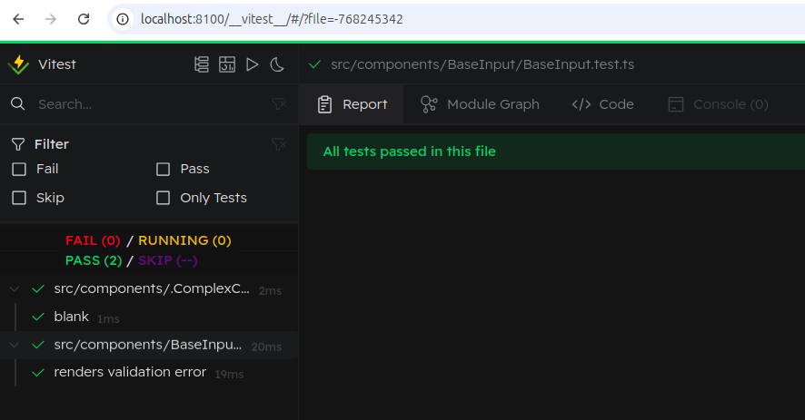
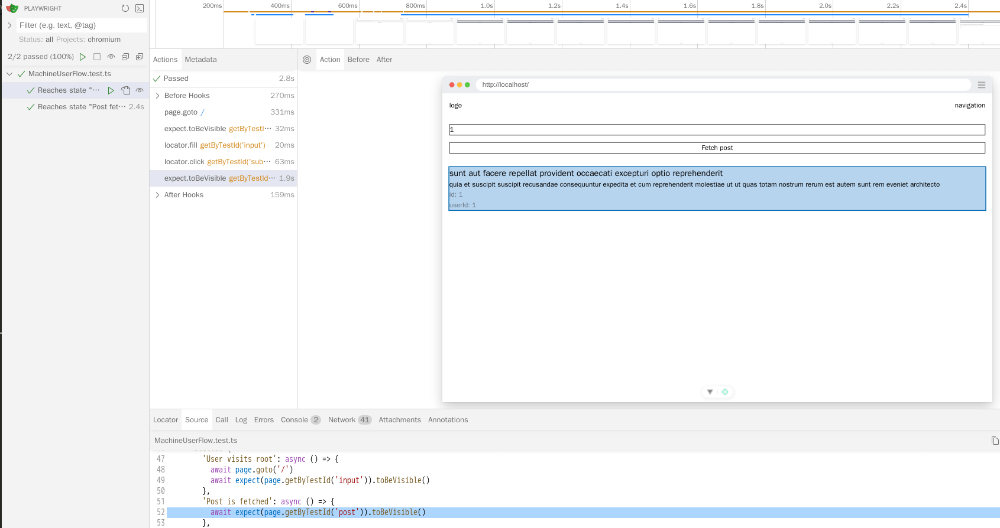

# The Superawesome Frontend Boilerplate


My Vue frontend starter with tests, CI/CD, backend - everything dockerized, don't even need nodejs locally! 

Also with a [styleguide](#styleguide) for large-scale frontend based on my experience

The only requirements are [docker](https://www.docker.com/) and [taskfile](https://taskfile.dev/).

## How to use
If you launch for the first time:
```
cd .dev
task env
task init
task up
```

If not:
```
cd .dev
task up
```

And that's all!

You now have tests, CI/CD, and other fancy buzzwords but nothing is installed on your machine locally. You are gorgeous!

Go to [localhost](http://localhost) and hooray!

## Stack

Frontend: [vue 3](https://vuejs.org/), [typescript](https://www.typescriptlang.org/), [xstate](https://stately.ai/), [tailwind](https://tailwindcss.com/), [vite-ssg](https://github.com/antfu/vite-ssg).

Backend: [nodejs](https://nodejs.org/), [express](https://expressjs.com/).

Test: [vitest](https://vitest.dev/) for unit, [playwright](https://playwright.dev/) for e2e.

Lint: [eslint](https://eslint.org/) with [custom config](./eslint.config.js) (based on [antfu/eslint-config](https://github.com/antfu/eslint-config)) + [stylelint](https://stylelint.io/) with [custom config](./stylelint.config.js).

## Features
- [Very detailed styleguide for large-scale frontend based on my experience](#styleguide).

- [Live unit-tests with UI](http://localhost:8100/__vitest__/).

  

- **E2E-tests with UI**.

  Superpowerful Playwright UI running in docker, you don't need to install anything on your machine!

  


- [Ready to CI/CD to Github Actions](./.github/workflows/).

  Test and build on `pull request` to `master`, deploy on `push` to `master`.

- [XState](https://stately.ai/).

  

  It's a tool that allows you to handle your logic using finite state machines which can be visualized. I am such a huge fan of it, I use it in every project. I have separate styleguide for dealing with machines [here](./src/machines/README.md).

  Also check how XState can own e2e-testing [here](./e2e/).

  Invest your time into learning it, it's an absolute game changer.

## Known issues:
- If you encounter `ENOENT: Permission denied` error, go to `.dev/.env` and replace `USERID` with yours. 

  It's your system user's id and group id. Usually user id (first value) is 1000 and group id (second value) is 1000 too.

  Run `id -u` and `id -g` in your terminal and change `USERID` value to what you will receive.

- If you are not on Linux, you need to go to [Taskfile.yaml](./.dev/Taskfile.yaml) and search for `TODO`.

  You will need to add some tweaks to the configuration.

---

# Styleguide

## General rules

1. Treat every component and page as a standalone project, [domain](https://vueschool.io/articles/vuejs-tutorials/domain-driven-design-with-nuxt-layers/). Try to make them as independent as possible without any external dependencies.

    Store everything related to component inside it's folder (assets, composables, subcomponents etc.).

    Create abstractions only when you need them, don't overengineer ahead of time. Create subcomponents only when you are absolutely sure it's necessary.

    Ask yourself: _"Can this component be used in another project as-is? Does it really need to be split into multiple components? Does it really need that dependency?"_.

    [It's a Locality of Behaviour Principle](https://htmx.org/essays/locality-of-behaviour/).

2. Don't hesitate to violate DRY if you feel that it will greatly improve the readability and simplicity of the code.

    For example, 3 of your components use small function, but it requires lots of dependencies. It's better to duplicate it and not make it external.

    But of course, it depends.

3. Don't be shy to use `SomeVeryLongAndAwkwardLookingNames`. Instead, prioritize self-explanation of your function or component.

    Ask yourself: _"If somebody without context will read this name, will he clearly understand what it does?"_.

    Another bonus is that it will let you easily search files by name.

4. Don't pass objects as arguments or props, fight with temptation to do it.

    Always pass primitive values, composables and components shouldn't know about the form of the object.

    First of all, it makes your code much more readable. And more importantly it makes writing unit tests sooooo much easier.

    Bad:
    ```javascript
    function useSomething({ bigObject }) {
      // using bigObject.property
      // using bigObject.anotherProperty
    }

    useSomething({ bigObject })
    ```
    ```javascript
    <ChildComponent :parent="parent" />
    ```
    Good:
    ```javascript
    function useSomething({ property, anotherProperty }) {
      // using property
      // using anotherProperty
    }

    useSomething({
      property: bigObject.property,
      anotherProperty: bigObject.anotherProperty
    })
    ```
    ```javascript
    <ChildComponent
        :parent-property="parent.property"
        :another-property="parent.another" />
    ```

5. Always use [vueuse](https://vueuse.org/). Moreover, check [releases](https://github.com/vueuse/vueuse/releases) from time to time, because they add new stuff pretty often.

## List of all guides

- [How to manage assets?](./src/assets/)

- [How to manage components?](./src/components/)

- [How does an example of complex component look?](./src/components/ComplexComponentExample/)

- [How to manage composables?](./src/composables/)

- [How to manage types?](./src/types/)

- [How to manage XState machines?](./src/machines/)

- [How does an example of XState machine look?](./src/components/FormLogin/machines/)

- [How to use XState for e2e testing?](./e2e/)

- [How to manage layouts?](./src/layouts/)

- [How to manage pages?](./src/pages/)
