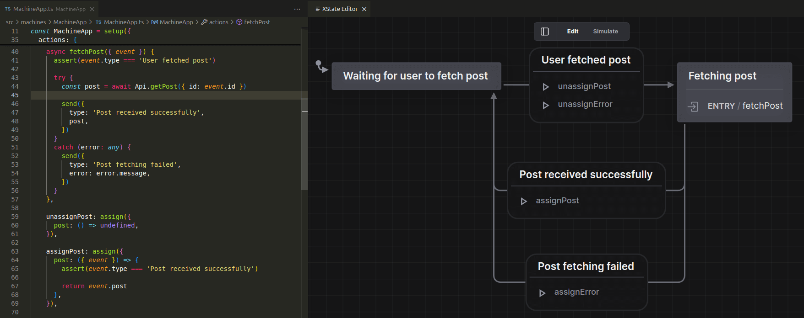
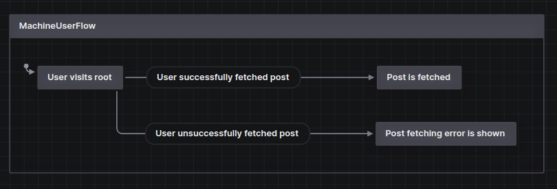
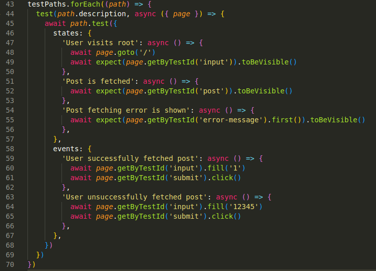

# The Superawesome Frontend Boilerplate


My Vue frontend starter with tests, CI/CD - everything dockerized, don't even need nodejs locally! The only requirements are [docker](https://www.docker.com/) and [taskfile](https://taskfile.dev/).

Also with a [styleguide](#styleguide) for large-scale frontend based on my experience.

## How to use
If you launch for the first time:
```
cd .dev
task env
task init
task up
```

If not:
```
cd .dev
task up
```

And that's all! You are gorgeous!

You now have:

1. [localhost](http://localhost) - where your application runs.

2. [localhost:8000](http://localhost:8000) - where preview of your application runs.

3. [localhost:8100/\_\_vitest__/](http://localhost:8100/__vitest__/) - where your Vitest UI Mode runs.

## Stack

Frontend: [vue 3](https://vuejs.org/), [typescript](https://www.typescriptlang.org/), [xstate](https://stately.ai/), [tailwind](https://tailwindcss.com/), [vite-ssg](https://github.com/antfu/vite-ssg).

Test: [vitest](https://vitest.dev/), [playwright](https://playwright.dev/).

Lint: [eslint](https://eslint.org/) with [custom config](./eslint.config.js) (based on [antfu/eslint-config](https://github.com/antfu/eslint-config)) + [stylelint](https://stylelint.io/) with [custom config](./stylelint.config.js).

## Features
- [Very detailed styleguide for large-scale frontend based on my experience](#styleguide).

- [Live unit-tests with UI](http://localhost:8100/__vitest__/).

  

- **E2E-tests with UI**.

  Superpowerful [Playwright UI Mode](https://playwright.dev/docs/test-ui-mode) running in docker, you don't need to install anything on your machine!

  

- [Ready to CI/CD to Github Actions](./.github/workflows/).

  Test and build on `pull request` to `master`, deploy on `push` to `master`.

- [XState](https://stately.ai/).

  

  It's a tool that allows you to handle your logic using finite state machines which can be visualized. I am such a huge fan of it, I use it in every project. I have a styleguide for dealing with machines [here](#how-to-manage-xstate-machines).

  Also check how XState can own e2e-testing [here](#how-to-use-xstate-for-e2e-testing).

  Invest your time into learning it, it's an absolute game changer.

## Known issues:
- If you encounter `ENOENT: Permission denied` error, go to `.dev/.env` and replace `USERID` with yours. 

  It's your system user's id and group id. Usually user id (first value) is 1000 and group id (second value) is 1000 too.

  Run `id -u` and `id -g` in your terminal and change `USERID` value to what you will receive.

- If you are not on Linux, you need to go to [Taskfile.yaml](./.dev/Taskfile.yaml) and search for `TODO`.

  You will need to add some tweaks to the configuration.

---

# Styleguide

- [General rules](#general-rules)

- [How to manage assets?](#how-to-manage-assets)

- [How to manage components?](#how-to-manage-components)

- [How to manage composables?](#how-to-manage-composables)

- [How to manage types?](#how-to-manage-types)

- [How to manage XState machines?](#how-to-manage-xstate-machines)

- [How does an example of XState machine look?](./src/machines/MachineApp/MachineApp.ts)

- [How to use XState for e2e testing?](#how-to-use-xstate-for-e2e-testing)

- [How to manage layouts?](#how-to-manage-layouts)

- [How to manage pages?](#how-to-manage-pages)

## General rules

1. Treat every component and page as a standalone project, [domain](https://vueschool.io/articles/vuejs-tutorials/domain-driven-design-with-nuxt-layers/). Try to make them as independent as possible without any external dependencies.

    Store everything related to component inside it's folder (assets, composables, subcomponents etc.).

    Create abstractions only when you need them, don't overengineer ahead of time. Create subcomponents only when you are absolutely sure it's necessary.

    Ask yourself: _"Can this component be used in another project as-is? Does it really need to be split into multiple components? Does it really need that dependency?"_.

    [It's a Locality of Behaviour Principle](https://htmx.org/essays/locality-of-behaviour/).

2. Don't hesitate to violate DRY if you feel that it will greatly improve the readability and simplicity of the code.

    For example, 3 of your components use small function, but it requires lots of dependencies. It's better to duplicate it and not make it external.

    But of course, it depends.

3. Don't be shy to use `SomeVeryLongAndAwkwardLookingNames`. Instead, prioritize self-explanation of your function or component.

    Ask yourself: _"If somebody without context will read this name, will he clearly understand what it does?"_.

    Another bonus is that it will let you easily search files by name.

4. Don't pass objects as arguments or props, fight with temptation to do it.

    Always pass primitive values, composables and components shouldn't know about the form of the object.

    First of all, it makes your code much more readable. And more importantly it makes writing unit tests sooooo much easier.

    Bad:
    ```javascript
    function useSomething({ bigObject }) {
      // using bigObject.property
      // using bigObject.anotherProperty
    }

    useSomething({ bigObject })
    ```
    ```javascript
    <ChildComponent :parent="parent" />
    ```
    Good:
    ```javascript
    function useSomething({ property, anotherProperty }) {
      // using property
      // using anotherProperty
    }

    useSomething({
      property: bigObject.property,
      anotherProperty: bigObject.anotherProperty
    })
    ```
    ```javascript
    <ChildComponent
        :parent-property="parent.property"
        :another-property="parent.another" />
    ```

5. Always use [vueuse](https://vueuse.org/). Moreover, check [releases](https://github.com/vueuse/vueuse/releases) from time to time, because they add new stuff pretty often.

    [Back to menu](#styleguide).

## How to manage assets?

Use [src/assets](./src/assets/) only for global assets. Create a folder for each category of assets.

Place component assets inside the component folder.

[Back to menu](#styleguide).

## How to manage components?

1. Naming goes from general to specific, from left to right.

    Bad: `PatientProfilePage`, `DropdownMessagesPatient`

    Good: `PageProfilePatient`, `PatientMessagesDropdown`

2. Each component sits in its folder, even the smallest one. The name of the folder is the name of the component and inside you have a `.vue` file, which duplicates the name. Not `index.vue`, not anything else.

    ```
    components/
        SomeComponent/
            SomeComponent.vue
    ```

3. If you are absolutely sure that your component must have subcomponents, place them in the `components` subfolder and you can omit the naming rule for them as long as they are "private" components.

    But think twice before creating subcomponents. Fat `<template>` is not bad, it allows you to keep things simple.

    You shouldn't have more than 1 level of nesting components. If you find yourself in a situation you need to dive deeper, it's a red flag you are doing something wrong.
    ```
    components/
        SomeComponent/
            SomeComponent.vue
            components/
                SubComponentNamedWithoutDuplicatingParentNameBecauseItIsTreatedAsPrivateComponent.vue
    ```

4. If your component requires assets, create an `assets` subfolder. Place all of the assets at one level without creating nested subfolders.
    ```
    components/
        SomeComponent/
            SomeComponent.vue
            assets/
                some-image.png
                another-asset-that-lays-on-same-level.mp4
    ```

5. If your component needs composable, create a `composables` subfolder. You can name composables as you want (just remember about the self-explanation name).
    ```
    components/
        SomeComponent/
            SomeComponent.vue
            composables/
                useOptionsForSorting.ts
    ```

6. Always create a folder, even if you are sure that there will be only one asset or one composable.

7. Import all of your "private" stuff in a relative way. It will help you easily divide global and local composables usage.

    Bad:
    ```javascript
    import { useOptionForSotring } from '@/components/SomeComponent/composables/useOptionsForSorting'
    ```
    Good:
    ```javascript
    import { useOptionForSorting } from './composables/useOptionsForSorting'
    ```

8. Never call something directly in `<template>`, always create your wrapper. It will serve as some kind of your internal API.

    Bad:
    ```javascript
    <SomeComponent @some-event="someExternalDependency.has.SomeMethod('foo')">
    ```

    Good:
    ```javascript
    <SomeComponent @some-event="yourFunctionInScriptSetupWhichCallsSomeExternalDependency">
    ```

9. If you work on a shared component and listen to user events, name functions like `onInput`, `onChange` (try to stick to native events naming). But in the parent component name listener by meaning in the present simple imperative mood.
    ```javascript
    <SomeComponent @change="updateFilter">
    ```

10. When you want to customize some shared component, try not using props.

    Instead, try utilizing [attribute inheritance](https://vuejs.org/guide/components/attrs).

    If it doesn't fit, use the power of [named scoped slots](https://vuejs.org/guide/components/slots.html#fancy-list-example) to give the consumers of your component freedom to customize.

    And only if nothing works, use props.

11. Don't hold any logic inside components, only emit events to the consumer even if you think it'd overhead right now.

    [Back to menu](#styleguide).

## How to manage composables?

1. Keep composables as small as possible. Avoid big composables which export lots of stuff. It can lead to lots of composables but it's ok. Name them by meaning, not by location.

    Bad:
    ```
    SomeComponent/
        composables/
            useSomeComponent.ts
        SomeComponent.vue
    ```
    Good:
    ```
    SomeComponent/
        composables/
            useTabs.ts
            useSortOptions.ts
            useFilters.ts
        SomeComponent.vue
    ```

2. Avoid fat `<script setup>`, instead divide logic into composables, not in reusability, but in organizing purpose (but remember that fat `<template>` is ok).

3. Don't pass arguments in order, instead take only 1 argument as an object and destructurize it (this rule applies to every function, not only composables).

    Bad: `function useSomething(some, arguments, for, composable)`

    Good: `function useSomething({ some, arguments, for, composable })`

4. Always give specific names to what composable returns.

    Bad:
    ```javascript
    function useTabsOptions() {
        // ...
        return { options }
    ```

    Good:
    ```javascript
    function useTabsOptions() {
        // ...
        return { tabsOptions }
    ```

    [Back to menu](#styleguide).

## How to manage types?

1. Avoid using `enums`, prefer [const assertions](https://www.typescriptlang.org/docs/handbook/typescript-in-5-minutes-func.html#readonly-and-const).
    ```javascript
    const tabs = [
        {
            name: 'Tab name',
            value: 'tab-value',
        },
        {
            name: 'Another tab',
            value: 'another-tab-value',
        },
    ] as const;

    export type TabValue = (typeof tabs)[number]['value'] // 'tab-value' | 'another-tab-value'
    ```

2. Types are always local and sit in the `types.ts` file.
    ```
    components/
        SomeComponent/
            SomeComponent.vue
            types.ts
    ```

3. Make types global only when you are sure they need to be shared (another component needs that type).

    Keep them small as possible too. Lots of small files are better than one huge.
    ```
    src/
        components
        pages
        types/
            TypePatientStatus.ts
            TypePatientOptions.ts
    ```

4. Group type files by content, not by domain.

    Bad:
    ```
    types/
        TypePageLogin.ts
    ```

    Good:
    ```
    types/
        TypeTabs.ts
        TypeOptions.ts
    ```

5. Group types inside file by categories.
    ```javascript
    // UI
    type Options = {
    ...

    // Fetch responses
    type FetchResponseLogin = {
    ...
    ```

    [Back to menu](#styleguide).

## How to manage XState machines?

I prefer the way when i have global singleton machines, not spawned and killed when user leaves page. It gives much more friendly DX when dealing with types, accessing context etc.

1. Try to avoid global state. Treat your machines as independent services. 

    If your machine needs data from another machine, try to pass that data in the moment of spawning machine. Avoid direct binding between machines.

    It will cause an overhead at the beginning, but while your application will grow and become more and more complex, you will benefit from it more and more.

2. Try to store only primitives in context. It just makes your code and understanding of what your machine does much easier.

    Bad:
    ```javascript
    context: {
        user: {
            name: string,
            data: {
                hp: number
            }
        }
    }
    ```
    Good:
    ```javascript
    context: {
        userName: string,
        userHp: number
    }
    ```

3. Name machines with capital letter, running services - same name but with lowercase.
    ```javascript
    const MachineIndex = setup({
        // ...
    })

    const machineIndex = useMachine(MachineIndex)
    ```

4. Machine for component always has the name `MachineIndex` and is located in the `machines` subfolder.
    ```
    components/
        SomeComponent/
            machines/
                MachineIndex.ts
            SomeComponent.vue
    ```

5. Check if the machine is in some state by tags, not by state name.

    Bad:
    ```javascript
    if(machineIndex.value.context.value.value === 'Some name') {
    ```
    Good:
    ```javascript
    if(machineIndex.value.context.value.hasTag('some-tag') {
    ```

6. When designing machine in visual editor, form some general rules and stick to them.

    For example:

    _All of the states are being drawn from left to right horizontally. Vertical states means another options_.

    You can have your own rules, but once you formed them stick to them.

7. Also create the rules about naming actions, events and states.

    For example:

    Events: passive verbs in past `Button was clicked`

    Actions: imperative verbs in present `fetchSessionInfo`

    States: adjectives or verbs in present `Fetching session info`

    You can make your own rules, but be consistent once you've formed them.

8. Keep your actions as small as possible. They must do only one thing. And do your best to keep them pure.

    It can lead to overhead with 5-6 actions for 1 transition, but it's ok. It makes people without context (even non-techs if you name them right) easily understand what is going on.

    Also, it makes it very easy for you to reuse action in another machine.

    Bad:
    ```javascript
    actions:
        assignContext() { ...
    ```
    Good:
    ```javascript
    actions:
        assignOneContextProperty() { ...
        assignAnotherContextProperty() { ...
        assignMoreContextProperty() { ...
    ```

9. Try to declare actions in `setup` in an order of their logical appearance.

10. If your actions accepts some arguments, write actions that use that arguments in that event, not in the "entry" of the state.

    It will help you easily visually divide inner logic from incoming.

    [Back to menu](#styleguide).

## How to use XState for e2e testing?

XState has an awesome package [@xstate/test](https://stately.ai/docs/xstate-test), which allows you to make your machine test providers.

You can create test models from your existing machines and treat it like "unit-testing" of your machines.

However, I prefer a different approach, when you create a separate machine for e2e-testing, which describes all of the possible user interactions with flows, like [MachineUserFlow](./e2e/MachineUserFlow.test.ts).





The event-based nature of state machines just fits perfectly with how users interact with the applications.

[Back to menu](#styleguide).

## How to manage layouts?

Include layout on every page, not in your `App.vue`.

It could be cumbersome, but it gives you the power of customization and controlling each page look individually.

Just create slots in layouts and override them on your page.

## How to manage pages?

Treat pages as components, they can have subcomponents, types, etc.

[Back to menu](#styleguide).